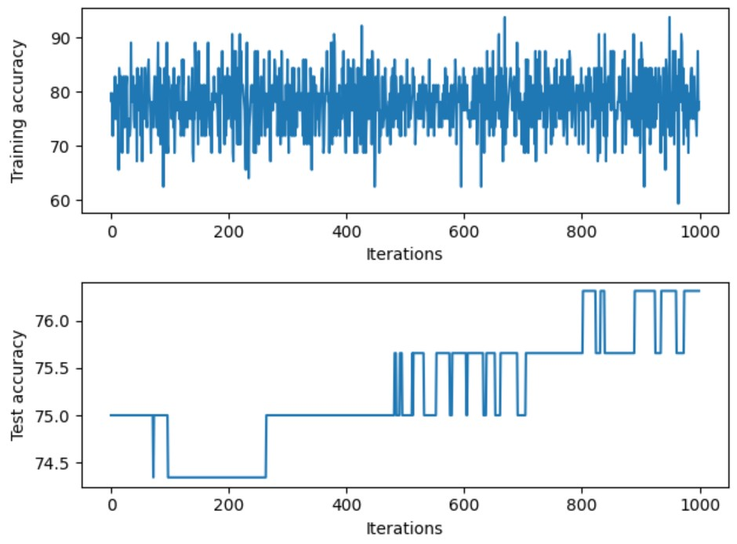

# A simple Neural Network with PyTorch

This repository contains a simple neural network project implemented using the PyTorch library. The project's main goal is to build and train a Convolutional Neural Network (CNN) to predict a binary target variable based on a dataset with seven features (f1, f2, f3, f4, f5, f6, f7).

## Table of Contents

- [Project Overview](#project-overview)
  - [Description of the Dataset](#description-of-the-dataset)
- [Preprocessing](#preprocessing)
  - [Tools Used](#tools-used)
- [Neural Network Architecture](#neural-network-architecture)
- [Part I: Building a Standard Convolutional Neural Network](#part-i-building-a-standard-convolutional-neural-network)
  - [Architecture](#architecture)
  - [Training Parameters](#training-parameters)
  - [Results](#results)
  - [Test and Training Accuracy Graphs](#test-and-training-accuracy-graphs)
- [Part II: Optimizing the Neural Network](#part-ii-optimizing-the-neural-network)
  - [Techniques Implemented](#techniques-implemented)
  - [Results](#results)
  - [Test and Training Accuracy Graphs with Different Setups](#test-and-training-accuracy-graphs-with-different-setups)
  - [Detailed Analysis](#detailed-analysis)

## Project Overview

Neural networks were implemented for binary classification in this project. The project focuses on building and training a standard Neural Network with two hidden layers and one output layer.

### Description of the Dataset

The dataset used for training and testing contains 767 data entries. It includes seven numeric feature variables (f1, f2, f3, f4, f5, f6, f7) and a binary target variable (target).

## Preprocessing

The preprocessing phase involved data cleaning and normalization. Non-numeric entries were removed from the dataset, and the feature variables were standardized using the `StandardScaler()` to ensure consistent data scaling.

### Tools Used

- Python's Pandas library was used to remove non-numeric entries.
- Data standardization and scaling were achieved using the `StandardScaler()` function.

## Neural Network Architecture

The standard CNN model consists of two hidden layers and one output layer. The `nn.Linear()` module was employed to apply linear transformations to incoming data. ReLU activation functions were used in the hidden layers. The model was trained with a batch size of 64, a learning rate of 0.001, and for 100 epochs.

## Part I: Building a Standard Convolutional Neural Network

### Architecture

- Input Layer: Seven feature variables (f1, f2, f3, f4, f5, f6, f7)
- Two Hidden Layers with ReLU activation
- Output Layer

### Training Parameters

- Batch Size: 64
- Learning Rate: 0.001
- Number of Epochs: 100

### Results

The maximum training accuracy achieved for the standard CNN model is 90.63%, and the maximum test accuracy is 76.32%.

### Test and Training Accuracy Graphs

## Part II: Optimizing the Neural Network

In the second part of the project, different techniques were applied to optimize the CNN model's accuracy.

### Techniques Implemented

1. **Dropout:** A dropout rate of 0.2 was implemented.
2. **Learning Rate Scheduler:** StepLR scheduler with step size 100 and gamma 0.1 was used.
3. **k-fold Cross-Validation:** k-fold cross-validation with k = 5.
4. **Early Stopping:** Early stopping with patience 5 and best epoch 0.

### Results

The optimization techniques were evaluated with different setups, and their impacts on accuracy were analyzed.

### Test and Training Accuracy Graphs with Different Setups

#### Dropout

The maximum training accuracy with dropout is 96.875%, and the maximum test accuracy is 76.97%. Dropout had a positive effect on the model without overfitting.

#### Learning Rate Scheduler

The maximum training accuracy with the learning rate scheduler is 100.0%, but there is overfitting, with a significant difference between training and testing accuracy.

#### k-fold Cross-Validation

The accuracy with k-fold cross-validation is 75.824%, which is lower than the standard CNN model. K-fold cross-validation did not improve accuracy.

#### Early Stopping

Early stopping resulted in a maximum training accuracy of 100.0% and a maximum test accuracy of 76.97%, with overfitting observed.

### Detailed Analysis

- Dropout improved accuracy without overfitting.
- Learning rate scheduler increased accuracy but led to overfitting.
- k-fold cross-validation did not improve accuracy.
- Early stopping did not have a positive effect and caused overfitting.

In conclusion, implementing dropout is recommended for improving model efficiency while avoiding overfitting.

---

This README provides an overview of the project, including the dataset, preprocessing steps, neural network architecture, and the results of implementing different optimization techniques. For more detailed information, refer to the complete report in the project directory.

Feel free to clone this repository and explore the code and dataset to understand the project in more detail.
